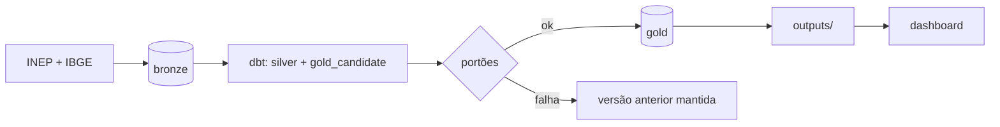

# Rota do Diploma · DataHack Univag 2026

De cada 100 que entram numa graduação em Mato Grosso, quantos chegam ao diploma, e em quais cursos
a rota se perde?

ELT em PostgreSQL 16 com dbt e Airflow: os arquivos públicos do INEP e a API do IBGE entram na
Bronze, o dbt monta Silver e Gold num schema candidato, e a Gold só é publicada (e exportada para
`outputs/`) quando as fontes obrigatórias e todos os testes passam. O dashboard lê `outputs/` e abre
em qualquer computador.



## Como rodar do zero (Windows, PowerShell)

Pré-requisitos: Docker Desktop aberto, Git e 10 GB livres.

```powershell
git config --global core.autocrlf false
git clone https://github.com/FellypeLimadaSilva/datahack.git
cd datahack
Set-ExecutionPolicy -Scope Process Bypass
.\scripts\dh.ps1 doctor
.\scripts\dh.ps1 up-lite
.\scripts\dh.ps1 smoke
```

Copie os downloads da pasta Downloads para o lugar certo (não move nem descompacta):

```powershell
.\scripts\dh.ps1 import-downloads
```

Ou coloque à mão, sem descompactar:

| Pasta | Arquivos |
|---|---|
| `data\landing\inep\censo\` | `microdados_censo_da_educacao_superior_2021.zip` ... `_2024.zip` |
| `data\landing\inep\trajetoria\` | `indicadores_trajetoria_es_2015_2024.zip` ... `_2020_2024.zip` |
| `data\landing\inep\qualidade\` | `CPC_2021.xlsx`, `cpc_2022.xlsx`, `CPC_2023.xlsx`, `IGC_*.xlsx`, `conceito_enade_licenciaturas.xlsx` |

Links em [docs/estrategia.md](docs/estrategia.md#3-fontes-e-onde-colocar-cada-uma). O IBGE vem pela
API, sem download. Depois:

```powershell
.\scripts\dh.ps1 pipeline
.\scripts\dh.ps1 dashboard
```

Sem Docker: [docs/LAB_SETUP.md](docs/LAB_SETUP.md#plano-sem-docker). Com Airflow:
`.\scripts\dh.ps1 up` e a DAG `medallion_pipeline` em http://localhost:8080.

## Por que ELT e não ETL

| | ETL (transformar antes de gravar) | ELT (gravar e transformar no banco), o que usamos |
|---|---|---|
| Onde fica a regra | No código Python da carga | Em SQL versionado no dbt (`dbt/models/`) |
| Mudar uma regra (ex.: evasão, edição do CPC, ano do curso) | Baixar e recarregar os arquivos (Censo 2024 tem ~450 MB) | Editar o SQL e rodar o dbt: 15 segundos |
| Dado original | Perdido depois da transformação | Guardado na Bronze, como veio do INEP |
| Erro de tipo (ex.: "1.234,5", "SC", célula vazia) | A carga quebra ou o valor some sem rastro | A carga nunca quebra; a Silver mede o que não converteu e o teste bloqueia |
| Auditoria de um número | Difícil: o intermediário não existe | Cada linha da Gold vem de uma linha da Bronze com arquivo e lote de origem |
| Testes de qualidade | Fora do fluxo | No mesmo banco, antes de publicar (82 testes do dbt) |
| Idempotência | Depende do script | Arquivo carregado uma vez (SHA-256); Silver e Gold sempre reconstruídas da Bronze |

A única coisa feita antes de gravar é o **recorte de Mato Grosso** nos dois arquivos nacionais
grandes (Censo e Trajetória): um filtro de linhas que não muda nenhum valor. Medido nos arquivos
reais, ele reduz 37 a 46 vezes o disco e deixa a carga 2 vezes mais rápida nas máquinas do
laboratório. Fora isso, é ELT puro: tipos, junções, indicadores e regra de células ficam no dbt.
Para voltar ao Brasil inteiro, basta tirar o `filter` em `config/sources.yml`.

## O que o `pipeline` garante

| Situação | Resultado |
|---|---|
| Rodar de novo sem arquivo novo | nada é recarregado; `outputs/` sai com o mesmo hash |
| Dois anos do Censo ou várias coortes | coexistem; cada partição tem sua versão |
| INEP republica uma coorte | só aquela coorte muda; a antiga fica na Bronze para auditoria |
| Fonte obrigatória falha ou perde coluna essencial | nada é publicado; a Gold e `outputs/` anteriores continuam |
| Teste do dbt falha | idem; motivo em `ops.publications` |
| Publicação errada | `.\scripts\dh.ps1 rollback` volta a versão anterior |
| Grupo com menos de 10 alunos | não sai da Gold; contagens de 1 a 9 saem vazias; o export confere de novo |

Tudo isso é exercitado por `tests/integration/test_rota_diploma.py` no CI.

## Respostas e onde estão

| Pergunta | Mart (Gold) e arquivo em `outputs/` |
|---|---|
| P1 Quanto da turma fica pelo caminho | `p1_trajetoria_coorte` |
| P2 Onde a rota mais se perde | `p2_desistencia_curso`, `p2_desistencia_area` |
| P3 Pública × privada, presencial × EAD | `p3_rede_modalidade_ano` |
| P4 Qualidade retém? | `p4_qualidade_curso`, `p4_qualidade_faixa`, `p4_fatores` |
| P5 Funil das licenciaturas | `p5_licenciaturas_curso`, `p5_funil_licenciaturas` |
| B1 Desertos de ensino superior | `b1_desertos_municipio` |
| B2 Financiamento e permanência | `b2_financiamento_ano`, `b2_financiamento_desistencia` |

População, numerador, denominador, período e agregação de cada indicador estão em
`dbt/models/gold/_gold__models.yml` e em `outputs/_indicadores.json`.

Primeiros números (coorte 2020, presencial, MT, acompanhada até 2024): 28.985 ingressantes em 621
cursos; de cada 100, 21,7 concluíram, 56,5 desistiram e 21,7 seguiam matriculados. A maior perda é
no primeiro ano (23,2 de cada 100).

## Pastas e arquivos

| Caminho | O que é |
|---|---|
| `README.md` | Este arquivo: como rodar, decisões e respostas |
| `requirements.txt`, `pyproject.toml` | Dependências Python (ingestão, dbt, testes) e configuração de lint |
| `docker-compose.yml` | Serviços: PostgreSQL (`warehouse`), backup diário, Airflow e a imagem `cli` que roda os comandos |
| `.env.example` | Modelo do `.env` com usuários e senhas; o `.env` real é gerado por `dh.ps1 env` e nunca vai para o Git |
| `.gitignore`, `.gitattributes`, `.editorconfig`, `.dockerignore` | Dados e segredos fora do Git; fim de linha LF nos scripts; padrão de editor; o que não entra na imagem |
| `.sqlfluff`, `.sqlfluffignore` | Padrão de estilo do SQL do dbt |
| **`config/`** | |
| `config/sources.yml` | As 7 fontes: onde está cada arquivo, formato, filtro de MT, se é obrigatória e quais colunas são essenciais |
| `config/exports.yml` | Quais tabelas da Gold vão para `outputs/` e por qual coluna se aplica a regra de 10 alunos |
| **`data/landing/inep/`** | Onde você coloca os downloads (fora do Git): `censo/`, `trajetoria/`, `qualidade/` |
| **`src/datahack_ingest/`** | O programa de ingestão e publicação (`python -m datahack_ingest ...`) |
| `cli.py` | Os comandos: `run`, `gate`, `pipeline`, `publish`, `rollback`, `export`, `validate`, `list`, `init` |
| `catalog.py` | Lê e valida o `config/sources.yml` |
| `extractors/files.py` | Lê CSV e Excel, dentro ou fora de zip, em blocos, com detecção de encoding e do cabeçalho |
| `extractors/api.py` | Chama a API do IBGE com novas tentativas em caso de erro |
| `extractors/base.py` | Tipos comuns aos extratores |
| `sniff.py` | Detecta encoding, separador e a linha do cabeçalho (a linha 9 das planilhas do INEP) |
| `normalize.py` | Padroniza nomes de colunas (minúsculas, sem acento) e converte tudo para texto |
| `transforms.py` | O recorte antes de gravar: `filter`, `rename`, `select_columns`, `drop_columns` |
| `runner.py` | Executa a ingestão de uma fonte: uma transação por arquivo, colunas essenciais, volume |
| `sinks/postgres.py` | Grava na Bronze com `COPY` e cria colunas novas quando o INEP muda o layout |
| `state.py` | Tabelas de controle em `ops`: execuções, manifesto de arquivos, publicações |
| `publish.py` | Portões de qualidade, `dbt build` no candidato, troca atômica da Gold e `rollback` |
| `export.py` | Gera `outputs/` (CSV, Parquet, manifesto) a partir da Gold publicada e confere células pequenas |
| `settings.py`, `logging_setup.py` | Lê o `.env` e configura os logs |
| **`dbt/`** | As transformações (ELT) |
| `dbt_project.yml`, `profiles.yml` | Configuração do projeto, variáveis do desafio (ano do curso 4, CPC 2021–2023, mínimo de 10) e conexão |
| `models/_core__sources.yml` | Declara as tabelas da Bronze e de `ops` que o dbt lê |
| `models/silver/staging/stg_*.sql` | Uma por fonte: tipos, códigos como texto, versão vigente de cada ano/coorte/edição |
| `models/silver/intermediate/int_*.sql` | Acumulados da Trajetória, Censo por curso, uma edição de CPC por curso |
| `models/gold/p*_*.sql`, `b*_*.sql` | Uma tabela por pergunta (P1 a P5, B1, B2) |
| `models/gold/controle_atualizacao.sql` | Última carga de cada fonte, para o "atualizado em" |
| `models/**/_*.yml` | Descrição, grão, métricas e testes de cada modelo |
| `macros/casting.sql` | Conversão segura de texto para número e data (vírgula decimal, vazio) |
| `macros/governance.sql` | Máscara de células pequenas, cálculo de taxa, rede, modalidade, versão por partição |
| `macros/tests.sql` | Testes próprios: grão único, células pequenas, balanço do fluxo, soma e contagem iguais |
| `macros/generate_schema_name.sql` | Faz o dbt usar os schemas `silver` e `gold_candidate` sem prefixo |
| **`airflow/dags/`** | `medallion_pipeline.py` (uma tarefa por fonte e depois `publicar`) e `warehouse_maintenance.py` (ANALYZE e limpeza semanal) |
| **`dashboard/`** | `app.py` (Streamlit), `layout.json` (blocos, gráficos e filtros), `requirements.txt` |
| **`outputs/`** | Tabelas publicadas (CSV e Parquet), `_manifest.json` (versão e fontes) e `_indicadores.json` (como cada número é calculado) |
| **`infra/`** | |
| `infra/postgres/bootstrap.sql`, `initdb/` | Cria roles, schemas e permissões na primeira subida do banco |
| `infra/postgres/postgresql.conf` | Ajustes do PostgreSQL para análise |
| `infra/postgres/backup.sh`, `restore_check.sh` | Backup diário e teste de restauração em banco vazio |
| `infra/cli/Dockerfile`, `infra/airflow/Dockerfile` | Imagens: CLI leve (ingestão + dbt) e Airflow |
| **`scripts/`** | |
| `scripts/dh.ps1` | Todos os comandos no Windows (`doctor`, `up-lite`, `pipeline`, `dashboard`...) |
| `scripts/init_env.py` | Gera o `.env` com senhas aleatórias e cria as pastas de dados |
| `scripts/generate_inep_fixtures.py` | Arquivos falsos no layout do INEP, usados só pelos testes e pelo CI |
| **`tests/`** | `unit/` (leitura de arquivos, catálogo, regras de exportação), `integration/` (banco real, incluindo o ponta a ponta `test_rota_diploma.py`), `fixtures/` |
| **`.github/workflows/ci.yml`** | CI: lint, testes no PostgreSQL, pipeline com arquivos de teste, permissões, backup e restauração, Airflow e imagem Docker |
| **`docs/`** | `estrategia.md` (Fase 1), `arquitetura.md` (Fases 2 e 3), `LAB_SETUP.md` (montar no laboratório), `RUNBOOK.md` (operação e erros), `ADDING_A_SOURCE.md` (nova base), `adr/` (decisões) |
| **`prompts/`** | Conversas com IA (obrigatório no evento) e o índice `README.md` |
| **`sql/`** | Consultas de exploração da equipe |

## Comandos

| Comando | O que faz |
|---|---|
| `.\scripts\dh.ps1 pipeline` | ingestão + portão + dbt em `gold_candidate` + publicação + `outputs/` |
| `.\scripts\dh.ps1 ingest [fonte]` | só a ingestão |
| `.\scripts\dh.ps1 gate` | mostra se as fontes obrigatórias estão completas |
| `.\scripts\dh.ps1 dbt-build [seletor]` | dbt no schema candidato, sem publicar |
| `.\scripts\dh.ps1 publish` / `rollback` | promove o candidato / volta a versão anterior |
| `.\scripts\dh.ps1 export` | exporta a Gold publicada |
| `.\scripts\dh.ps1 dashboard` | abre o dashboard |

## Camadas e roles

| Schema | Conteúdo | Escreve | Lê |
|---|---|---|---|
| `bronze` | arquivos como vieram, tudo texto, com arquivo e lote de origem | `dh_ingestor` | `dh_transformer` |
| `ops` | execuções, manifesto de arquivos, publicações | `dh_ingestor` | `dh_transformer` |
| `silver` | modelos tipados e intermediários | `dh_transformer` | — |
| `gold_candidate` | versão em construção | `dh_transformer` | — |
| `gold` | versão publicada | troca de schema | `dh_bi_reader` |
| `gold_previous` | versão anterior, para rollback | troca de schema | — |

## Stack

PostgreSQL 16 · Python 3.12 · dbt-core 1.12 · Airflow 3.3 · Docker Compose · Streamlit · GitHub
Actions. Decisões em [docs/estrategia.md](docs/estrategia.md) e
[docs/arquitetura.md](docs/arquitetura.md).
