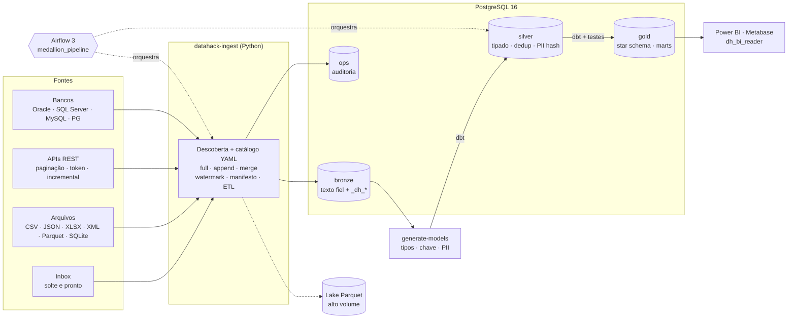

# DataHack — Plataforma de Dados ELT/ETL (Medalhão)

Ambiente pré-montado de engenharia de dados para o evento **DataHack**. Solte um arquivo ou banco
em `data/landing/inbox/` e ele chega sozinho a **Bronze → Silver → Gold**: formato, separador e
encoding detectados, tipos inferidos (decimal com vírgula, datas dd/mm, JSON), chave e duplicatas
tratadas, CPF/e-mail/telefone pseudonimizados e testes de qualidade gerados. Para fontes que pedem
regra de negócio, o catálogo YAML e o dbt continuam disponíveis. Warehouse PostgreSQL 16 com
menor privilégio, orquestração com **Airflow 3** e entrega para **Power BI / Metabase**, tudo em
Docker e versionado como código.



## Início rápido (Windows, PowerShell)

Pré-requisitos: **Docker Desktop** (6 GB+ de RAM alocada), **Git**, **Python 3.12+** e **VS Code**.

```powershell
git clone https://github.com/FellypeLimadaSilva/datahack.git
cd datahack
python scripts/init_env.py        # gera .env com segredos aleatórios (nunca commitado)
docker compose up -d --build      # warehouse + Airflow (primeiro build: ~5 min)
.\scripts\dh.ps1 sample           # dataset sintético de varejo (opcional, DH_EXAMPLES=true)
.\scripts\dh.ps1 demo-inbox       # arquivos bagunçados de demonstração na inbox (opcional)
.\scripts\dh.ps1 pipeline         # ingestão + Silver/Gold automáticas + dbt build
```

Com os seus dados: copie para `data/landing/inbox/` e rode `.\scripts\dh.ps1 pipeline`
(ou dispare a DAG `medallion_pipeline`). `.\scripts\dh.ps1 discover` mostra antes o que cada
arquivo vai virar.

Linux/macOS/WSL: troque `.\scripts\dh.ps1 <cmd>` por `make <cmd>`. No VS Code:
`Ctrl+Shift+P → Tasks: Run Task → DH: ...` executa os mesmos passos.

| Serviço | Endereço | Credencial |
|---|---|---|
| Airflow (UI/API) | http://localhost:8080 | `AIRFLOW_ADMIN_USER` / `AIRFLOW_ADMIN_PASSWORD` do `.env` |
| PostgreSQL (warehouse) | `localhost:5433` / db `datahack` | roles abaixo, senhas no `.env` |
| pgAdmin (`--profile tools`) | http://localhost:5050 | `PGADMIN_*` |
| Metabase (`--profile bi`) | http://localhost:3000 | criado no primeiro acesso |
| Réplica de leitura (`--profile ha`) | `localhost:5434` | mesmas roles do warehouse |

**Power BI:** Obter dados → PostgreSQL → servidor `localhost:5433`, banco `datahack`,
usuário `dh_bi_reader`. Só o schema `gold` fica visível (regra de ouro do consumo).

## Camadas e roles

| Schema | Conteúdo | Escrita | Leitura |
|---|---|---|---|
| `bronze` | Dado bruto fiel à origem; todas as colunas `text` + `_dh_batch_id`, `_dh_ingested_at`, `_dh_source_file`, `_dh_row_hash` | `dh_ingestor` | `dh_transformer` |
| `ops` | Execuções, watermarks, manifesto, schema drift, rejeições, perfil das tabelas automáticas | `dh_ingestor` | `dh_transformer` |
| `silver` | Tipado (casts seguros), deduplicado, PII pseudonimizada; automática por tabela ou modelada à mão | `dh_transformer` | — |
| `gold` | Uma view pronta por tabela automática, `dh_catalogo_dados`, `dim_data`, `controle_atualizacao` e o modelo dimensional de exemplo | `dh_transformer` | `dh_bi_reader` (somente leitura, timeout 120 s) |

## Comandos principais

| Objetivo | PowerShell | make |
|---|---|---|
| Subir / parar | `dh.ps1 up` / `dh.ps1 down` | `make up` / `make down` |
| Ver o que a inbox detectou | `dh.ps1 discover` | `make discover` |
| Ingerir tudo / uma fonte | `dh.ps1 ingest` / `dh.ps1 ingest vendas` | `make ingest` / `make ingest s=vendas` |
| Gerar Silver/Gold automáticas | `dh.ps1 models` / `dh.ps1 models --reset` | `make models` / `make models reset=1` |
| Pipeline completo | `dh.ps1 pipeline` | `make pipeline` |
| Perfilar fonte nova sem gravar | `docker compose run --rm cli python -m datahack_ingest run <fonte> --dry-run` | idem |
| dbt (models + testes) | `dh.ps1 dbt-build` / `dh.ps1 dbt-build fact_vendas+` | `make dbt-build sel=fact_vendas+` |
| Testes Python | `dh.ps1 test` | `make test` |
| Console SQL | `dh.ps1 psql` | `make psql` |
| Backup imediato | `dh.ps1 backup` | `make backup` |
| Subir réplica de leitura | `dh.ps1 ha-up` | `make ha-up` |
| Testar canais de alerta | `dh.ps1 alert-test` | `make alert-test` |

## Três formas de trazer dados

| Forma | Quando usar | O que você faz |
|---|---|---|
| **Inbox** (zero configuração) | Arquivos e bancos SQLite do evento | Copia para `data/landing/inbox/`; uma pasta = uma tabela, arquivo solto = uma tabela, cada aba do Excel e cada tabela do SQLite = uma tabela |
| **Inbox + `_source.yml`** | Precisa ajustar chave, PII, estratégia ou formato | Coloca um `_source.yml` na pasta (ex.: `primary_key: [id]`, `load_strategy: merge`) |
| **Catálogo** (`config/sources.yml`) | APIs, bancos corporativos, ETL antes de gravar, exclusões | Declara a fonte; segredos só por nome de variável |

Silver e Gold são geradas para toda tabela que não tenha modelo dbt escrito à mão. Quando a regra
de negócio pedir (dimensões, fatos, marts), crie o modelo em `dbt/models/` usando
`source('bronze', '<tabela>')`: a geração automática daquela tabela para sozinha.
Guia completo: [docs/ADDING_A_SOURCE.md](docs/ADDING_A_SOURCE.md).

## Componentes opcionais

Nada precisa ser usado por inteiro. O mínimo é PostgreSQL + `datahack-ingest` + dbt.

| Componente | Desligar com |
|---|---|
| Dados e modelos de exemplo (varejo) | `DH_EXAMPLES=false` |
| Descoberta automática da inbox | `DH_INBOX_ENABLED=false` |
| Silver/Gold automáticas | `DH_AUTO_MODELS=false` |
| Airflow | não subir os serviços `airflow-*`; usar `dh.ps1 pipeline` |
| Réplica, backup, pgAdmin, Metabase | perfis `ha`, `tools`, `bi` ou não subir o serviço |
| ETL na ingestão, alertas, checagem de volume, exclusões | só atuam quando declarados |

## Garantias de engenharia

- **Exactly-once na Bronze:** cada arquivo/execução é gravado na mesma transação do seu registro de controle; reexecutar não duplica (manifesto por SHA-256).
- **Falha isolada:** uma fonte quebrada não impede a Gold das demais; a execução termina como falha e alerta (`DH_REQUIRE_ALL_SOURCES=true` exige todas). `dbt build` usa os testes como gate.
- **Inferência auditável:** tipos e chaves ficam fixos depois de inferidos (`ops.data_catalog`); valor que não cabe no tipo vira nulo na Silver, fica intacto na Bronze e dispara aviso de teste.
- **Schema drift tratado:** colunas novas são adicionadas sozinhas e registradas em `ops.schema_changes`.
- **Quarentena:** linha com chave nula vai para `ops.rejected_rows` (com payload) em vez de quebrar a carga.
- **Concorrência segura:** lock consultivo por fonte; `max_active_runs=1` na DAG.
- **Contratos de dados:** tabelas da Gold consumidas pelo BI têm nome e tipo de coluna travados (`contract.enforced`).
- **LGPD:** dados fora do Git (`.gitignore` + hook), CPF pseudonimizado com SHA-256 + salt, BI sem acesso à Bronze/Silver.
- **ELT e ETL:** transformações opcionais antes de gravar (filtrar, mascarar, hash, descartar colunas, função Python própria).
- **Exclusões na origem:** detectadas por snapshot ou por consulta de chaves, com exclusão lógica ou física e trava contra exclusão em massa.
- **Histórico SCD tipo 2:** `dbt snapshot` de lojas e produtos, com `dim_*_historico` na Gold.
- **Formatos:** CSV/TXT/TSV, JSON, JSONL, Parquet, Excel (todas as abas), XML, largura fixa, Avro, ORC e SQLite; compactados em gzip, bz2, xz, zstd ou zip; leitura em streaming. Arquivo não tabular (PDF, imagem, .xls antigo, Access, dump SQL) é ignorado com o motivo e a orientação.
- **Bancos e APIs em escala:** extração SQL paralela por faixa de chave; REST, GraphQL e OAuth2 client credentials.
- **Observabilidade:** alertas em Slack, Teams, webhook ou e-mail; checagem de volume que bloqueia carga anômala.
- **Resiliência:** backup diário verificado com role somente leitura; réplica de leitura em streaming (`--profile ha`).

## Documentação

- [Arquitetura e decisões](docs/ARCHITECTURE.md) · [ADRs](docs/adr/)
- [Adicionar fonte](docs/ADDING_A_SOURCE.md) · [Runbook de operação](docs/RUNBOOK.md)
- [Segurança e LGPD](SECURITY.md) · [Como contribuir](CONTRIBUTING.md) · [Changelog](CHANGELOG.md)

## Stack

Python 3.12 · pandas 3 / PyArrow · SQLAlchemy 2 · psycopg 3 · PostgreSQL 16 ·
dbt-core 1.12 + dbt-postgres 1.11 · Apache Airflow 3.3 (LocalExecutor) ·
Docker Compose · GitHub Actions · Ruff · SQLFluff · pre-commit · gitleaks.
