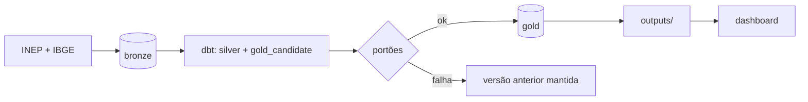

# Rota do Diploma · DataHack Univag 2026

De cada 100 que entram numa graduação em Mato Grosso, quantos chegam ao diploma, e em quais cursos
a rota se perde?

ELT em PostgreSQL 16 com dbt e Airflow: os arquivos públicos do INEP e a API do IBGE entram na
Bronze, o dbt monta Silver e Gold num schema candidato, e a Gold só é publicada (e exportada para
`outputs/`) quando as fontes obrigatórias e todos os testes passam. O dashboard lê `outputs/` e abre
em qualquer computador.



## Como rodar do zero (Windows, PowerShell)

Pré-requisitos: Docker Desktop aberto, Git e 10 GB livres.

```powershell
git config --global core.autocrlf false
git clone https://github.com/FellypeLimadaSilva/datahack.git
cd datahack
Set-ExecutionPolicy -Scope Process Bypass
.\scripts\dh.ps1 doctor
.\scripts\dh.ps1 up-lite
.\scripts\dh.ps1 smoke
```

Coloque os downloads (sem descompactar) em:

| Pasta | Arquivos |
|---|---|
| `data\landing\inep\censo\` | `microdados_censo_da_educacao_superior_2021.zip` ... `_2024.zip` |
| `data\landing\inep\trajetoria\` | `indicadores_trajetoria_es_2015_2024.zip` ... `_2020_2024.zip` |
| `data\landing\inep\qualidade\` | `CPC_2021.xlsx`, `cpc_2022.xlsx`, `CPC_2023.xlsx`, `IGC_*.xlsx`, `conceito_enade_licenciaturas.xlsx` |

Links em [docs/estrategia.md](docs/estrategia.md#3-fontes-e-onde-colocar-cada-uma). O IBGE vem pela
API, sem download. Depois:

```powershell
.\scripts\dh.ps1 pipeline
.\scripts\dh.ps1 dashboard
```

Sem Docker: [docs/LAB_SETUP.md](docs/LAB_SETUP.md#plano-sem-docker). Com Airflow:
`.\scripts\dh.ps1 up` e a DAG `medallion_pipeline` em http://localhost:8080.

## O que o `pipeline` garante

| Situação | Resultado |
|---|---|
| Rodar de novo sem arquivo novo | nada é recarregado; `outputs/` sai com o mesmo hash |
| Dois anos do Censo ou várias coortes | coexistem; cada partição tem sua versão |
| INEP republica uma coorte | só aquela coorte muda; a antiga fica na Bronze para auditoria |
| Fonte obrigatória falha ou perde coluna essencial | nada é publicado; a Gold e `outputs/` anteriores continuam |
| Teste do dbt falha | idem; motivo em `ops.publications` |
| Publicação errada | `.\scripts\dh.ps1 rollback` volta a versão anterior |
| Grupo com menos de 10 alunos | não sai da Gold; contagens de 1 a 9 saem vazias; o export confere de novo |

Tudo isso é exercitado por `tests/integration/test_rota_diploma.py` no CI.

## Respostas e onde estão

| Pergunta | Mart (Gold) e arquivo em `outputs/` |
|---|---|
| P1 Quanto da turma fica pelo caminho | `p1_trajetoria_coorte` |
| P2 Onde a rota mais se perde | `p2_desistencia_curso`, `p2_desistencia_area` |
| P3 Pública × privada, presencial × EAD | `p3_rede_modalidade_ano` |
| P4 Qualidade retém? | `p4_qualidade_curso`, `p4_qualidade_faixa`, `p4_fatores` |
| P5 Funil das licenciaturas | `p5_licenciaturas_curso`, `p5_funil_licenciaturas` |
| B1 Desertos de ensino superior | `b1_desertos_municipio` |
| B2 Financiamento e permanência | `b2_financiamento_ano`, `b2_financiamento_desistencia` |

População, numerador, denominador, período e agregação de cada indicador estão em
`dbt/models/gold/_gold__models.yml` e em `outputs/_indicadores.json`.

Primeiros números (coorte 2020, presencial, MT, acompanhada até 2024): 28.985 ingressantes em 621
cursos; de cada 100, 21,7 concluíram, 56,5 desistiram e 21,7 seguiam matriculados. A maior perda é
no primeiro ano (23,2 de cada 100).

## Estrutura

```
config/sources.yml        fontes do desafio (obrigatórias, colunas essenciais)
config/exports.yml        o que vai para outputs/
src/datahack_ingest/      ingestão, portões, publicação e exportação
dbt/models/silver/        stg_* (tipagem, grão) e int_* (acumulados, junções)
dbt/models/gold/          marts P1-P5, B1, B2
airflow/dags/             medallion_pipeline e warehouse_maintenance
dashboard/                Streamlit lendo outputs/ (layout.json define os blocos)
outputs/                  tabelas publicadas (CSV, Parquet, manifesto)
docs/                     estrategia.md (Fase 1), arquitetura.md (Fases 2 e 3)
prompts/                  conversas com IA usadas no projeto
sql/                      consultas de exploração
```

## Comandos

| Comando | O que faz |
|---|---|
| `.\scripts\dh.ps1 pipeline` | ingestão + portão + dbt em `gold_candidate` + publicação + `outputs/` |
| `.\scripts\dh.ps1 ingest [fonte]` | só a ingestão |
| `.\scripts\dh.ps1 gate` | mostra se as fontes obrigatórias estão completas |
| `.\scripts\dh.ps1 dbt-build [seletor]` | dbt no schema candidato, sem publicar |
| `.\scripts\dh.ps1 publish` / `rollback` | promove o candidato / volta a versão anterior |
| `.\scripts\dh.ps1 export` | exporta a Gold publicada |
| `.\scripts\dh.ps1 dashboard` | abre o dashboard |

## Camadas e roles

| Schema | Conteúdo | Escreve | Lê |
|---|---|---|---|
| `bronze` | arquivos como vieram, tudo texto, com arquivo e lote de origem | `dh_ingestor` | `dh_transformer` |
| `ops` | execuções, manifesto de arquivos, publicações | `dh_ingestor` | `dh_transformer` |
| `silver` | modelos tipados e intermediários | `dh_transformer` | — |
| `gold_candidate` | versão em construção | `dh_transformer` | — |
| `gold` | versão publicada | troca de schema | `dh_bi_reader` |
| `gold_previous` | versão anterior, para rollback | troca de schema | — |

## Stack

PostgreSQL 16 · Python 3.12 · dbt-core 1.12 · Airflow 3.3 · Docker Compose · Streamlit · GitHub
Actions. Decisões em [docs/estrategia.md](docs/estrategia.md) e
[docs/arquitetura.md](docs/arquitetura.md).
