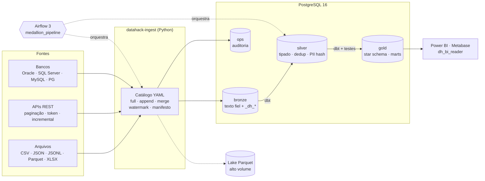

# DataHack — Plataforma de Dados ELT (Medalhão)

Ambiente pré-montado de engenharia de dados para o evento **DataHack**: ingestão
config-driven de **qualquer fonte** (arquivos, APIs, bancos), warehouse PostgreSQL 16
com segurança de menor privilégio, transformação e testes com **dbt**, orquestração
com **Airflow 3** e entrega pronta para **Power BI / Metabase** — tudo em Docker,
reproduzível com um comando e versionado como código.



## Início rápido (Windows, PowerShell)

Pré-requisitos: **Docker Desktop** (6 GB+ de RAM alocada), **Git**, **Python 3.12+** e **VS Code**.

```powershell
git clone https://github.com/FellypeLimadaSilva/datahack.git
cd datahack
python scripts/init_env.py        # gera .env com segredos aleatórios (nunca commitado)
docker compose up -d --build      # warehouse + Airflow (primeiro build: ~5 min)
.\scripts\dh.ps1 sample           # dataset sintético de varejo (500 mil itens de venda)
.\scripts\dh.ps1 pipeline         # ingestão + dbt build (54 nós: models + testes)
```

Linux/macOS/WSL: troque `.\scripts\dh.ps1 <cmd>` por `make <cmd>`. No VS Code:
`Ctrl+Shift+P → Tasks: Run Task → DH: ...` executa os mesmos passos.

| Serviço | Endereço | Credencial |
|---|---|---|
| Airflow (UI/API) | http://localhost:8080 | `AIRFLOW_ADMIN_USER` / `AIRFLOW_ADMIN_PASSWORD` do `.env` |
| PostgreSQL (warehouse) | `localhost:5433` / db `datahack` | roles abaixo, senhas no `.env` |
| pgAdmin (`--profile tools`) | http://localhost:5050 | `PGADMIN_*` |
| Metabase (`--profile bi`) | http://localhost:3000 | criado no primeiro acesso |
| Réplica de leitura (`--profile ha`) | `localhost:5434` | mesmas roles do warehouse |

**Power BI:** Obter dados → PostgreSQL → servidor `localhost:5433`, banco `datahack`,
usuário `dh_bi_reader`. Só o schema `gold` fica visível (regra de ouro do consumo).

## Camadas e roles

| Schema | Conteúdo | Escrita | Leitura |
|---|---|---|---|
| `bronze` | Dado bruto fiel à origem; todas as colunas `text` + `_dh_batch_id`, `_dh_ingested_at`, `_dh_source_file`, `_dh_row_hash` | `dh_ingestor` | `dh_transformer` |
| `ops` | Execuções, watermarks, manifesto de arquivos, schema drift, linhas rejeitadas | `dh_ingestor` | `dh_transformer` |
| `silver` | Tipado (casts seguros), deduplicado, PII pseudonimizada (views + incremental) | `dh_transformer` | — |
| `gold` | `dim_data`, `dim_loja`, `dim_produto`, `fact_vendas`, `fact_estoque_foto`, marts, `controle_atualizacao` | `dh_transformer` | `dh_bi_reader` (somente leitura, timeout 120 s) |

## Comandos principais

| Objetivo | PowerShell | make |
|---|---|---|
| Subir / parar | `dh.ps1 up` / `dh.ps1 down` | `make up` / `make down` |
| Ingerir tudo / uma fonte | `dh.ps1 ingest` / `dh.ps1 ingest vendas` | `make ingest` / `make ingest s=vendas` |
| Perfilar fonte nova sem gravar | `docker compose run --rm cli python -m datahack_ingest run <fonte> --dry-run` | idem |
| dbt (models + testes) | `dh.ps1 dbt-build` / `dh.ps1 dbt-build fact_vendas+` | `make dbt-build sel=fact_vendas+` |
| Testes Python | `dh.ps1 test` | `make test` |
| Console SQL | `dh.ps1 psql` | `make psql` |
| Backup imediato | `dh.ps1 backup` | `make backup` |
| Subir réplica de leitura | `dh.ps1 ha-up` | `make ha-up` |
| Testar canais de alerta | `dh.ps1 alert-test` | `make alert-test` |

## Adicionar uma fonte em 5 minutos

1. Coloque o arquivo em `data/landing/<pasta>/` (ou configure URL de API/banco).
2. Declare a fonte em [`config/sources.yml`](config/sources.yml) (segredos só por nome de variável).
3. `python -m datahack_ingest run <fonte> --dry-run` → confira colunas e linhas.
4. `python -m datahack_ingest run <fonte>` → tabela `bronze.<fonte>` criada automaticamente.
5. Crie `dbt/models/silver/stg_<fonte>.sql` com as macros de cast e teste no `.yml`.

Guia completo: [docs/ADDING_A_SOURCE.md](docs/ADDING_A_SOURCE.md).

## Garantias de engenharia

- **Exactly-once na Bronze:** cada arquivo/execução é gravado na mesma transação do seu registro de controle; reexecutar não duplica (manifesto por SHA-256).
- **Sem dado parcial na Gold:** a DAG só roda o dbt se todas as fontes carregarem; `dbt build` usa os testes como gate.
- **Schema drift tratado:** colunas novas são adicionadas sozinhas e registradas em `ops.schema_changes`.
- **Quarentena:** linha com chave nula vai para `ops.rejected_rows` (com payload) em vez de quebrar a carga.
- **Concorrência segura:** lock consultivo por fonte; `max_active_runs=1` na DAG.
- **Contratos de dados:** tabelas da Gold consumidas pelo BI têm nome e tipo de coluna travados (`contract.enforced`).
- **LGPD:** dados fora do Git (`.gitignore` + hook), CPF pseudonimizado com SHA-256 + salt, BI sem acesso à Bronze/Silver.
- **ELT e ETL:** transformações opcionais antes de gravar (filtrar, mascarar, hash, descartar colunas, função Python própria).
- **Exclusões na origem:** detectadas por snapshot ou por consulta de chaves, com exclusão lógica ou física e trava contra exclusão em massa.
- **Histórico SCD tipo 2:** `dbt snapshot` de lojas e produtos, com `dim_*_historico` na Gold.
- **Qualquer formato:** CSV, JSON, JSONL, Parquet, Excel, XML, largura fixa, Avro e ORC; compactados em gzip, bz2, xz, zstd ou zip; leitura em streaming.
- **Bancos e APIs em escala:** extração SQL paralela por faixa de chave; REST, GraphQL e OAuth2 client credentials.
- **Observabilidade:** alertas em Slack, Teams, webhook ou e-mail; checagem de volume que bloqueia carga anômala.
- **Resiliência:** backup diário verificado com role somente leitura; réplica de leitura em streaming (`--profile ha`).

## Documentação

- [Arquitetura e decisões](docs/ARCHITECTURE.md) · [ADRs](docs/adr/)
- [Adicionar fonte](docs/ADDING_A_SOURCE.md) · [Runbook de operação](docs/RUNBOOK.md)
- [Segurança e LGPD](SECURITY.md) · [Como contribuir](CONTRIBUTING.md) · [Changelog](CHANGELOG.md)

## Stack

Python 3.12 · pandas 3 / PyArrow · SQLAlchemy 2 · psycopg 3 · PostgreSQL 16 ·
dbt-core 1.12 + dbt-postgres 1.11 · Apache Airflow 3.3 (LocalExecutor) ·
Docker Compose · GitHub Actions · Ruff · SQLFluff · pre-commit · gitleaks.
