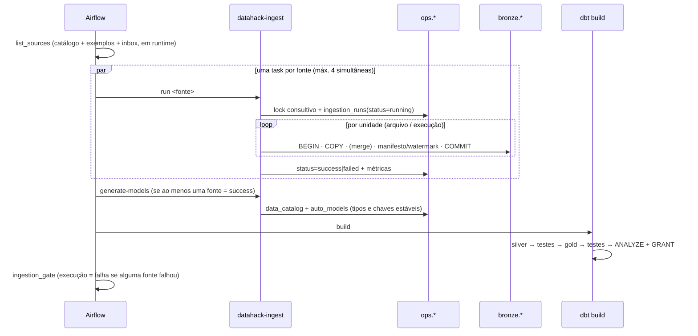
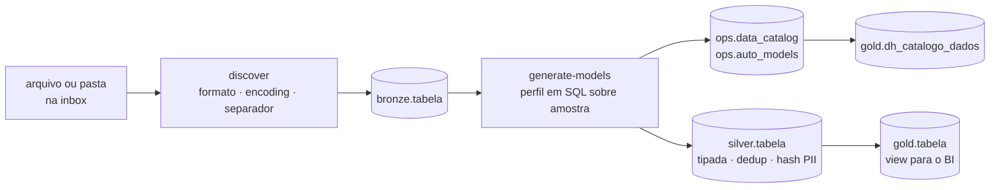

# Arquitetura

## 1. Princípios

1. **ELT medalhão:** carregar primeiro, fiel à origem; transformar dentro do warehouse, versionado (dbt).
2. **Zero configuração por padrão, config over code quando preciso:** arquivo na inbox vira fonte sozinho; regra específica = YAML validado, não código novo.
3. **Orquestrador-agnóstico:** toda etapa é uma CLI (`python -m datahack_ingest`, `dbt`). Airflow, CI e terminal executam exatamente o mesmo comando.
4. **Regra de ouro do consumo:** BI lê somente `gold`, com uma role de leitura com timeout.
5. **Auditável por padrão:** toda execução deixa rastro em `ops` (quem, quando, quanto, resultado, `run_id` do Airflow).
6. **Seguro por padrão:** menor privilégio, segredos fora do código, portas só em `127.0.0.1`, dado fora do Git.

## 2. Componentes

| Componente | Responsabilidade | Onde |
|---|---|---|
| Inbox | Descoberta automática de arquivos e bancos SQLite | `data/landing/inbox/`, `discovery.py` |
| Catálogo | Declara fontes, estratégia, chave, watermark, PII, dono | `config/sources.yml` (+ `examples.yml`) |
| `datahack-ingest` | Extract + Load para Bronze/Lake, controle em `ops` | `src/datahack_ingest/` |
| Gerador de modelos | Perfila a Bronze e escreve Silver/Gold + testes no dbt | `modelgen.py` → `dbt/models/auto/` |
| Warehouse | PostgreSQL 16 tunado para OLAP, roles e schemas | `infra/postgres/` |
| dbt | Silver (limpeza/tipagem/PII), Gold (dimensional), testes, contratos | `dbt/` |
| Airflow 3 | Agenda, paraleliza (`.expand`), faz retry e aplica o gate de qualidade | `airflow/dags/` |
| CI | Lint, segredos, e2e em PostgreSQL real, parse das DAGs, build da imagem | `.github/workflows/ci.yml` |

## 3. Fluxo de uma execução (`medallion_pipeline`)

## 4. Estratégias de carga

| Estratégia | Quando usar | Mecânica | Custo |
|---|---|---|---|
| `full` | Cadastros pequenos, origem sem chave/data | `TRUNCATE` + `COPY` numa transação (atômico para leitores) | Reprocessa tudo |
| `append` | Eventos/logs/fotos imutáveis | `COPY` direto; dedup na Silver por `row_number()` | Mínimo na carga |
| `merge` | Entidades que mudam (pedido, cliente) | `COPY` para temp → `INSERT … ON CONFLICT DO UPDATE` só se `_dh_row_hash` mudou | Índice único na chave |

Incremental por **watermark tipado** (`timestamp | integer | string`) em API e SQL; por **manifesto SHA-256** em arquivos.
No `merge`, o filtro usa `>=` (borda reprocessada com segurança); nos demais, `>`.

## 5. Por que a Bronze é toda `text`

- Nenhuma carga quebra por tipo inesperado na origem (o erro mais comum em evento/hackathon).
- Evolução de schema vira `ALTER TABLE ADD COLUMN … text`, sem migração.
- A tipagem acontece uma vez, na Silver, com `pg_input_is_valid` (PG 16): valor inválido vira `NULL` e é **medido** (`assert_vendas_sem_perda_de_cast` nos exemplos, `_dh_invalid_columns` + `dh_invalid_ratio` nas automáticas), em vez de abortar o pipeline.

## 6. Escala: o que suporta e qual o próximo passo

| Faixa | Arquitetura recomendada | O que muda |
|---|---|---|
| até ~100 GB / centenas de milhões de linhas | **Padrão deste repositório** | Nada. COPY em lotes, extração SQL paralela, BRIN em `_dh_ingested_at`, incremental na Silver/Gold |
| 100 GB – 1 TB | PostgreSQL com particionamento declarativo por mês nas fatos | `partition by range (data_venda)`; mais RAM e `work_mem`; BI na réplica (`--profile ha`) |
| > 1 TB ou streaming | `sink: parquet` (lake) + engine distribuída | Trocar o adapter dbt (`dbt-databricks`, `dbt-spark`, `dbt-duckdb`, Fabric); os models da Silver/Gold são SQL quase ANSI e as macros isolam o que é específico do PostgreSQL |

A ingestão já é limitada por memória constante (lotes de `chunk_size`), lê de S3/ADLS/GCS via `fsspec`
e escreve Parquet particionado (`ingest_date=`), então o caminho de escala não exige reescrever a extração.

Ponto de atenção conhecido: o hash SHA-256 de arquivo lê o arquivo duas vezes (hash + carga). Em objetos muito grandes no S3,
troque por ETag/versão do objeto.

## 7. Decisões de materialização

| Camada | Materialização | Motivo |
|---|---|---|
| Silver (cadastros) | `view` | Barato, sempre atualizado, sem reprocessamento |
| Silver (`stg_vendas`) | `incremental` (delete+insert, lookback 2 h) | Volume + contém hash de PII (salt não pode ficar em definição de view) |
| Gold dimensões / marts | `table` + índices + `ANALYZE` | Performance de consumo no BI |
| Gold `fact_vendas` | `incremental` com contrato | Escala sem rebuild; interface estável |

## 8. Regras de negócio modeladas (varejo)

- **LY:** `dim_data.data_ano_anterior` (calendário) e `data_mesmo_dia_semana_ano_anterior` (−364 dias, varejo).
- **L4L (venda comparável):** loja aberta durante todo o mês equivalente do ano anterior e ainda aberta no mês (`mart_vendas_mensal_loja.is_comparavel_l4l`).
- **Meta/compromisso:** `stg_metas` converte decimal pt-BR; `atingimento_meta_pct` no mart mensal.
- **Estoque (semiaditivo):** soma entre lojas/produtos; no tempo, só a última foto (`is_ultima_foto_mes`).
- **Feriados:** fixos via seed + móveis via algoritmo da Páscoa (testado contra datas oficiais).
- **Dia da semana:** ISO (`isodow`), independente de configuração de sessão.
- **Última atualização no BI:** `gold.controle_atualizacao` (carga real), nunca `NOW()`/`TODAY()` no DAX.

## 9. ETL opcional na ingestão

O padrão é ELT: a Bronze guarda o dado fiel e o dbt transforma. Quando o dado não pode
ou não deve chegar ao banco, a fonte declara `transforms`, aplicadas em cada lote depois da
normalização e antes da gravação:

| Operação | Uso típico |
|---|---|
| `filter` | Descartar linhas irrelevantes (eq, ne, in, not_in, gt, gte, lt, lte, is_null, not_null, regex) |
| `hash_columns` | Pseudonimizar PII com o mesmo algoritmo e salt do dbt (`dh_hash_pii`) |
| `mask_columns` | Mascarar mantendo os últimos N caracteres (cartão, telefone) |
| `drop_columns` / `select_columns` / `rename` | Minimização de dados (LGPD) e padronização |
| `deduplicate`, `trim`, `upper`, `lower`, `add_constant` | Limpeza leve |
| `python` | Regra própria: `modulo:funcao(df) -> df` |

Linhas descartadas ficam contadas em `ops.ingestion_runs.rows_filtered`.

## 10. Exclusões na origem

`delete_detection` em fontes `merge`:

| Escopo | Como sabe o que foi apagado | Quando usar |
|---|---|---|
| `snapshot` | Cada arquivo/execução é a foto completa da entidade; chave ausente = excluída | Exportações completas, APIs sem incremental |
| `keys_query` | Consulta leve que lista todas as chaves atuais da origem | Tabelas SQL grandes com carga incremental |

`mode: soft` marca `_dh_deleted_at` e atualiza `_dh_ingested_at` (propaga para os incrementais;
a Silver filtra e a fato marca `is_excluida`). `mode: hard` apaga da Bronze. Em ambos, a trava
`max_delete_ratio` aborta a transação inteira se a proporção de exclusões passar do limite,
e um snapshot vazio nunca apaga nada.

## 11. Histórico SCD tipo 2

`dbt/snapshots` versiona lojas e produtos (`strategy: check`, `hard_deletes: invalidate`).
A Gold expõe `dim_loja_historico` e `dim_produto_historico` com `valido_de`, `valido_ate`
e `is_atual`. Para "como era em uma data": `valido_de <= data < coalesce(valido_ate, 'infinity')`.

## 12. Alta disponibilidade, backup e alertas

| Recurso | Implementação |
|---|---|
| Backup | Serviço `warehouse-backup`: `pg_dump` diário com `dh_backup` (somente leitura), verificação com `pg_restore --list`, SHA-256 e retenção |
| Réplica | `--profile ha`: streaming replication com slot físico; `max_slot_wal_keep_size` protege o disco do primário |
| Alertas | Falha de ingestão, volume anômalo e falha de task no Airflow em Slack, Teams, webhook ou e-mail |
| Volume | `volume_check`: compara com a mediana das últimas execuções; `fail` bloqueia a carga full antes do commit |

## 13. Inbox e Silver/Gold automáticas

- Uma tabela com modelo dbt escrito à mão (`source('bronze', 'x')`) nunca recebe modelo automático.
- Silver automática: `table`; vira `incremental` (merge na chave ou no hash da linha) acima de
  `DH_AUTO_INCREMENTAL_ROWS`. Exclusão física na origem força `table`.
- Gold automática: view sobre a Silver, sem colunas técnicas, sem linhas excluídas, com
  `dh_atualizado_em`. A view é do `dh_transformer`, então o BI lê a Gold sem acesso à Silver.
- Linha com chave nula não entra na Silver; o teste de origem avisa quantas são.
- Regras de inferência e limites: [ADR 0008](adr/0008-inbox-e-modelos-automaticos.md) e
  [Adicionar fonte](ADDING_A_SOURCE.md#como-a-silvergold-automática-decide).

## 14. Componentes opcionais

| Mínimo para funcionar | Opcional |
|---|---|
| PostgreSQL, `datahack-ingest`, dbt | Airflow (o mesmo fluxo roda por `dh.ps1 pipeline`), exemplos (`DH_EXAMPLES`), inbox (`DH_INBOX_ENABLED`), geração automática (`DH_AUTO_MODELS`), réplica, backup, pgAdmin, Metabase, alertas, ETL, checagem de volume, detecção de exclusões |

## 15. Registro de decisões (ADRs)

Veja [docs/adr/](adr/). Toda decisão estrutural nova entra como ADR numerado.
