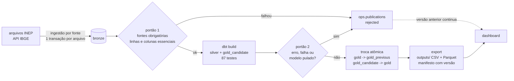

# Arquitetura (Fases 2 e 3)

## 1. Princípios

1. **ELT medalhão:** carregar primeiro, fiel à origem; transformar dentro do PostgreSQL com dbt,
   versionado e testado. Antes de gravar, só o recorte de MT (filtro de linhas, nenhum valor muda).
2. **Explícito, não automático:** cada fonte tem entrada própria no catálogo (pasta, padrão de
   arquivo, membro do zip, aba, cabeçalho, colunas essenciais) e cada tabela da Silver e da Gold é
   escrita à mão, com grão declarado e testado.
3. **Nada é publicado sem passar pelos portões:** a Gold que o BI lê só muda quando as fontes
   obrigatórias e todos os testes passam; caso contrário a versão anterior continua valendo.
4. **Orquestrador-agnóstico:** toda etapa é um comando (`python -m datahack_ingest ...`, `dbt`).
   Airflow, CI, PowerShell e terminal executam o mesmo comando.
5. **Menor privilégio:** quatro roles (ingestão, transformação, leitura de BI, backup); o BI só lê a
   Gold publicada; portas só em `127.0.0.1`; segredos no `.env`, fora do Git.
6. **Auditável:** toda ingestão, publicação e rejeição fica em `ops`.

## 2. Componentes

| Componente | Responsabilidade | Onde |
|---|---|---|
| Catálogo | Fontes do desafio, obrigatórias ou opcionais, colunas essenciais | `config/sources.yml` |
| `datahack-ingest` | Extract + Load na Bronze, manifesto de arquivos, portões, publicação, exportação | `src/datahack_ingest/` |
| PostgreSQL 16 | Warehouse com schemas `bronze`, `silver`, `gold_candidate`, `gold`, `gold_previous`, `ops` | `infra/postgres/` |
| dbt | Silver (`stg_*`, `int_*`) e Gold (marts P1–P5, B1, B2) com testes | `dbt/` |
| Airflow 3 | Uma tarefa de ingestão por fonte com retry; tarefa `publicar` | `airflow/dags/` |
| Dashboard | Streamlit lendo `outputs/` | `dashboard/` |
| CI | Lint, testes ponta a ponta em PostgreSQL real, parse das DAGs, imagem, restauração | `.github/workflows/ci.yml` |

## 3. Fluxo de uma execução

Comando: `python -m datahack_ingest pipeline` (ou `.\scripts\dh.ps1 pipeline`). No Airflow, a DAG
`medallion_pipeline` executa uma tarefa `ingerir__<fonte>` por fonte e depois `publicar`, que roda
o mesmo `pipeline --skip-ingest` olhando apenas as ingestões daquela execução
(`--orchestrator-run-id`). Uma fonte obrigatória que falhou bloqueia a publicação.

## 4. Estratégias de carga

| Estratégia | Fontes | Mecânica | Repetição |
|---|---|---|---|
| `append` | INEP (arquivos) | `COPY` por arquivo; arquivo e manifesto na mesma transação; arquivo já visto (SHA-256) é pulado | não carrega nada; outputs com o mesmo hash |
| `full` | IBGE (API) | `TRUNCATE` + `COPY` na mesma transação; zero linhas = falha, a versão anterior fica | troca pelo mesmo conteúdo |

Versão por partição: o INEP publica um arquivo por ano (Censo), por coorte (Trajetória) e por
edição (CPC, IGC). A Silver escolhe, para cada partição, o arquivo carregado por último
(`dh_latest_partition`). Um arquivo corrigido substitui só a própria partição; as demais seguem
iguais e a versão antiga continua na Bronze para auditoria.

O `TRUNCATE` da carga `full` bloqueia leitores da tabela da Bronze até o `COMMIT` e tem a ressalva
de MVCC documentada pelo PostgreSQL (transações antigas veem a tabela vazia). Só o dbt lê a Bronze,
e ele roda depois da ingestão; o BI nunca lê a Bronze. A leitura sem interrupção para o BI vem da
troca de schema: consultas em andamento terminam na versão antiga e as novas já resolvem para a nova.

## 5. Modelagem

| Camada | Modelo | Grão | Papel |
|---|---|---|---|
| Silver | `stg_trajetoria` | curso × coorte × ano de referência | tipagem, rede pela categoria administrativa, `nu_ano_curso` |
| | `stg_censo_cursos` | ano × curso × município | só MT |
| | `stg_censo_ies`, `stg_cpc`, `stg_igc` | ano/edição × IES ou curso | |
| | `stg_enade_licenciaturas`, `stg_ibge_populacao` | curso; município × idade | vazios enquanto a fonte opcional não chega |
| | `int_trajetoria_acumulada` | igual a `stg_trajetoria` | desistência, conclusão e óbito acumulados; teste de balanço do fluxo |
| | `int_trajetoria_marco` | curso × coorte | acumulados no ano do curso de comparação e no último ano |
| | `int_censo_curso_ano` | ano × curso | soma dos municípios, só graduação |
| | `int_cpc_curso` | curso | uma edição de CPC (a mais recente) |
| | `int_curso_desistencia` | curso | coortes somadas + CPC, sem máscara |
| | `int_curso_perfil_social` | curso × fator | parcela de escola pública, cotas, apoio social, noturno, FIES/ProUni, PPI no Censo |
| Gold | `p1_trajetoria_coorte` | modalidade × coorte × ano | P1 |
| | `p2_desistencia_curso`, `p2_desistencia_area` | curso × coorte; área × coorte × ano do curso | P2 |
| | `p3_rede_modalidade_ano` | ano × rede × modalidade | P3 |
| | `p4_qualidade_curso`, `p4_qualidade_faixa`, `p4_fatores` | curso; faixa × rede; fator | P4 (faixas 1–5, "Sem conceito (SC)" e "Não avaliado") |
| | `p5_licenciaturas_curso`, `p5_funil_licenciaturas` | curso; rede | P5 |
| | `b1_desertos_municipio` | município | B1: vagas e ingressantes presenciais por 100 jovens |
| | `b2_financiamento_ano`, `b2_financiamento_desistencia` | ano × modalidade; quartil | B2 |
| | `s1_fator_social_desistencia` | fator social × quartil | P4/B2: o que mais explica |

Cada mart documenta em `meta` a população, o numerador, o denominador, o período, a agregação e o
grão (`dbt/models/gold/_gold__models.yml`). Esses metadados vão para `outputs/_indicadores.json` e
aparecem no dashboard em "Como este número é calculado". Taxas são sempre soma do numerador sobre
soma do denominador, nunca média de taxas.

Definições que mudam o resultado e estão fixadas em `dbt_project.yml`:

| Variável | Valor | Efeito |
|---|---|---|
| `ano_curso_comparacao` | 4 | coortes e cursos são comparados no mesmo ano do curso |
| `cpc_edicoes` | 2021, 2022, 2023 | edição de qualidade usada: a mais recente do curso nesse intervalo |
| `min_cell` | 10 | regra de células pequenas |
| `min_base_ranking` | 30 | rankings e correlações só com cursos de 30 ou mais ingressantes |

Taxas da Trajetória = acumulado ÷ (ingressantes − falecidos acumulados), o mesmo método do INEP; o teste `dh_matches_inep_rates` confere cada linha contra TDA, TCA e TAP do arquivo (diferença máxima medida: 0,000000005 ponto percentual).

Contagens do Censo que vêm vazias em um curso (por exemplo ProUni parcial) contam como zero na
soma, para o curso não sumir do total.

Evasão anual do Censo (P3) = desvinculados ÷ (matrículas + trancados + desvinculados + transferidos
+ falecidos). Transferido para outro curso da mesma IES não conta como evasão.

## 6. Proteção de células pequenas

| Onde | Regra |
|---|---|
| Gold | linhas com base abaixo de 10 não são publicadas; contagens `qt_*` entre 1 e 9 viram vazio (`dh_mask_count`) |
| dbt | teste `dh_no_small_cells` em todos os marts; falha bloqueia a publicação |
| Exportação | confere de novo e falha se alguma contagem entre 1 e 9 aparecer; remove linhas com base abaixo de 10 |
| Dashboard | lê só `outputs/`; não reagrega contagens e não tem acesso ao banco, então filtros, gráficos e tooltips só mostram o que já foi publicado |
| PDF do pitch | gerado do dashboard, herda a regra |

Risco residual documentado: uma taxa com base 10–29 permite estimar o numerador; por isso rankings
e correlações exigem 30 ou mais ingressantes. Totais publicados não são recalculados a partir das
linhas mascaradas.

## 7. Entrega do dashboard

- O dashboard lê `outputs/` (Parquet, ou CSV se faltar), que é versionado no Git: abre em qualquer
  computador, pendrive ou no Streamlit Community Cloud, sem banco. O banco continua restrito a
  `127.0.0.1`.
- Cada exportação traz `_manifest.json` com versão publicada, horário, arquivos de origem com
  SHA-256, resultado do dbt e linhas suprimidas, e `_indicadores.json` com os metadados de cada
  indicador.
- A interface é feita de blocos declarados em `dashboard/layout.json` (tabela, tipo de gráfico,
  eixos, filtros compatíveis e padrão). Filtros só aparecem no bloco cuja tabela tem aquela coluna.
- Ordem, visibilidade e largura dos blocos são configuração visual, separada dos cálculos; a
  personalização é salva em `dashboard/layout.local.json` (fora do Git).
- Plano B: PDF com prints do dashboard e vídeo curto, gerados a partir da mesma versão.

## 8. Capacidade

Medido: Censo MT de 2 anos em 48 s e 26 MB; Trajetória de uma coorte em 32 s; dbt completo em 15 s
no ambiente de desenvolvimento (sem medição ainda nas máquinas do laboratório). A leitura é em fluxo (CSV em blocos de 50 mil linhas; zip lido membro a
membro), então a memória fica limitada pelo bloco e não pelo arquivo. Para os 4 anos do Censo e as
6 coortes, a estimativa é de 3 a 4 minutos de ingestão na primeira carga e segundos nas seguintes.
Volumes maiores (por exemplo o Brasil inteiro) são uma hipótese de capacidade a medir, não uma
garantia.

## 9. Backup e recuperação

`warehouse-backup` gera `pg_dump` diário com SHA-256. `pg_restore --list` só confirma que o arquivo
é legível; a recuperação é provada por `infra/postgres/restore_check.sh`, que restaura o dump num
banco vazio, compara a contagem de linhas de todas as tabelas de `ops`, `bronze`, `silver` e `gold`
com a origem e confere as permissões de leitura da Gold. O CI executa essa verificação.

## 10. Segurança

| Role | Pode | Não pode |
|---|---|---|
| `dh_ingestor` | escrever `bronze` e `ops` | ler `silver` ou `gold` |
| `dh_transformer` | ler `bronze`/`ops`, escrever `silver`, `gold_candidate`, publicar | |
| `dh_bi_reader` | ler `gold` publicada (somente leitura, timeout de 120 s) | ler `gold_candidate`, `gold_previous`, `silver`, `bronze` |
| `dh_backup` | `pg_dump` (somente leitura) | escrever |

Os dados do desafio são públicos e agregados por curso; não há dado pessoal na plataforma.
